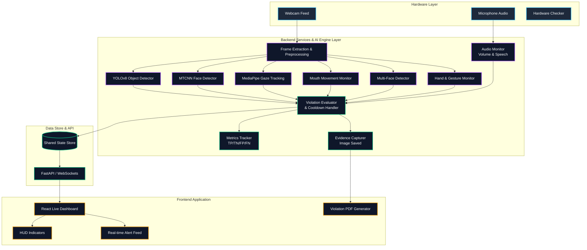

<br align="center">
  
  <h1 align="center">ShieldX 🛡️</h1>
  <p align="center"><strong>Advanced AI-Powered Exam Proctoring & Integrity Monitoring System</strong></p>
  <p align="center">
    
    
    
    
    
  </p>
</br>

## 🚀 Overview

**ShieldX** (formerly ExamProctor) is a production-grade, multi-modal AI proctoring system designed to ensure academic integrity during high-stakes examinations. It combines **state-of-the-art computer vision algorithms**, **behavioral biometrics**, and **real-time audio analysis** to monitor students asynchronously without needing invasive kernel-level installations. 

With its zero-tolerance architecture for false positives, it evaluates multiple detector networks simultaneously—providing proctors with a comprehensive, low-latency live dashboard.

---

## ✨ Core Features

### 👁️ Multi-Modal Vision Engine
- **Face Authentication (MTCNN):** Verifies the student's presence and continuously detects absence.
- **Gaze Tracking (MediaPipe):** Estimates the 3D gaze vector to flag sustained off-screen looking.
- **Mouth & Talking Detection:** Monitors lip movements to detect unauthorized whispering or speaking.
- **Object Detection (YOLOv8):** Real-time localization of unauthorized items (cell phones, earbuds, books).
- **Multiple Faces Detection:** Instantly flags the presence of unauthorized individuals in the camera frame.
- **Hand Gesture Tracking:** MediaPipe-based tracking to flag suspicious hand movements or communication.

### 🎙️ Advanced Audio Monitoring
- Active microphone analysis capturing amplitude thresholds.
- Continuous background processing to detect whispers, conversations, and ambient anomalies.

### 📊 Metric & Diagnostics Generation
- Computes real-time **Confusion Matrix** parameters (True Positives, False Positives, etc.).
- Auto-generates **ML Performance Metrics** including F1 Score, Precision, Accuracy, and Matthews Correlation Coefficient (MCC).

### 🖥️ Dashboard & Reporting
- **HUD Aesthetic Live Monitor:** Interactive React dashboard showing live telemetry, tracking statuses, and dynamic metrics.
- **Automated Evidence Capture:** Takes timestamps and snapshot evidence at the exact moment a violation occurs.
- **PDF Report Generation:** Uses Jinja2 and Matplotlib to compile beautiful, evidence-backed final summary reports.

---

## 🏗️ System Architecture & Workflow

Below is the real-time processing pipeline and data flow map for ShieldX.



---

## 🛠️ Technology Stack

| Category | Technology |
|---|---|
| **Frontend Framework** | React 18, React Router, TypeScript, Vite |
| **Styling & UI Components** | CSS (Native), Lucide React Icons |
| **Authentication** | Clerk Auth |
| **Backend Framework** | FastAPI, Uvicorn, WebSockets |
| **Computer Vision ML** | PyTorch, Ultralytics (YOLOv8), MediaPipe, Facenet-PyTorch |
| **Audio Processing** | PyAudio, SoundDevice (Local) |
| **Reporting Tooling** | Jinja2, Matplotlib, ReportLab/pdfkit |

---

## ⚙️ Getting Started

To run ShieldX locally, you will need to operate both the Frontend and Backend servers simultaneously.

### 1. Backend Setup

Open a terminal and navigate to the backend directory:
```bash
cd backend
```

Create a virtual environment and install requirements:
```bash
python -m venv venv
source venv/bin/activate  # On Windows use `venv\Scripts\activate`

# Depending on your need, install local requirements (includes hardware bindings)
pip install -r requirements.txt
```

Run the AI server:
```bash
python src/main.py
```
> *Note: Press `q` in the OpenCV video window to stop monitoring and instantly generate a session performance report.*

### 2. Frontend Setup

In a new terminal window, navigate to the frontend directory:
```bash
cd frontend
```

Install Node.js dependencies:
```bash
npm install
```

Start the Vite development server:
```bash
npm run dev
```

Navigate to `http://localhost:5173` in your browser. 
Log in or sign up (handled via Clerk) to enter the Dashboard.

---

## 🔒 Privacy & Permissions

ShieldX requires hardware permissions to function properly. Ensure your OS grants terminal or browser access to:
1. Webcam
2. Microphone
3. Screen Recording (Based on config overrides)

---

## 📜 License

This project is proprietary and confidential. Modification, distribution, and use must strictly adhere to the policies established by the organization unless categorized under an open-source MIT configuration. All Rights Reserved.
